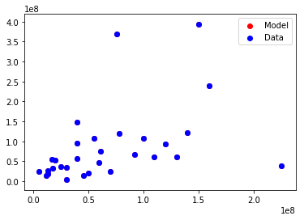
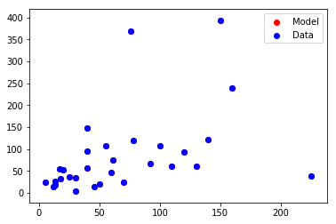
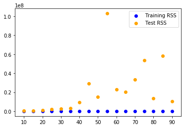

# Train Test Split <a id="toc"></a>

Thus far we've simply been fitting models to data and calculating the error between various models and the actual data. This can lead to various problems such as overfitting where we overtune our models to these specific data points and fail to disern more generalizable patterns that will apply to future cases. 

Let's look at a few examples of how we could modify some of our algorithms to overfit data:

### Introduction  

Now that you've seen some basic linear regression models it's time to discuss further how to better tune these models. As you saw, we usually begin with an error or loss function for which we'll apply an optimization algorithm such as gradient descent. We then apply this optimization algorithm to the error function we're trying to minimize and voila, we have an optimized solution! Unfortunately, things aren't quite that simple. 

### Overfitting and Underfitting
Most importantly is the issue of generalization.
This is often examined by discussing underfitting and overfitting.


Recall our main goal when performing regression: we're attempting to find relationships that can generalize to new cases. Generally, the more data that we have the better off we'll be as we can observe more patterns and relationships within that data. However, some of these patterns and relationships may not generalize well to other cases. 

## Let's intentionally overfit some data to see this in demonstration.

### 1. Import the data and define X and Y.


```python
#Import the Data here.
path = './data/' #The subdirectory where the file is stored
filename = 'movie_data_detailed.xlsx' #The filename
full_path = path + filename #Alternative shortcut

import pandas as pd
from decimal import Decimal

df = pd.read_excel(path+filename)
df.head()
```


<div>
<style scoped>
    .dataframe tbody tr th:only-of-type {
        vertical-align: middle;
    }

    .dataframe tbody tr th {
        vertical-align: top;
    }

    .dataframe thead th {
        text-align: right;
    }
</style>
<table border="1" class="dataframe">
  <thead>
    <tr style="text-align: right;">
      <th></th>
      <th>budget</th>
      <th>domgross</th>
      <th>title</th>
      <th>Response_Json</th>
      <th>Year</th>
      <th>imdbRating</th>
      <th>Metascore</th>
      <th>imdbVotes</th>
    </tr>
  </thead>
  <tbody>
    <tr>
      <th>0</th>
      <td>13000000</td>
      <td>25682380</td>
      <td>21 &amp;amp; Over</td>
      <td>NaN</td>
      <td>2008.0</td>
      <td>6.8</td>
      <td>48.0</td>
      <td>206513.0</td>
    </tr>
    <tr>
      <th>1</th>
      <td>45658735</td>
      <td>13414714</td>
      <td>Dredd 3D</td>
      <td>NaN</td>
      <td>2012.0</td>
      <td>NaN</td>
      <td>NaN</td>
      <td>NaN</td>
    </tr>
    <tr>
      <th>2</th>
      <td>20000000</td>
      <td>53107035</td>
      <td>12 Years a Slave</td>
      <td>NaN</td>
      <td>2013.0</td>
      <td>8.1</td>
      <td>96.0</td>
      <td>537525.0</td>
    </tr>
    <tr>
      <th>3</th>
      <td>61000000</td>
      <td>75612460</td>
      <td>2 Guns</td>
      <td>NaN</td>
      <td>2013.0</td>
      <td>6.7</td>
      <td>55.0</td>
      <td>173726.0</td>
    </tr>
    <tr>
      <th>4</th>
      <td>40000000</td>
      <td>95020213</td>
      <td>42</td>
      <td>NaN</td>
      <td>2013.0</td>
      <td>7.5</td>
      <td>62.0</td>
      <td>74170.0</td>
    </tr>
  </tbody>
</table>
</div>


As we see above that the values in `budget` and `domgross` column are extremely large, it would be a great idea to re-format these values by dividing these columns by a million. 


```python
df['budget'] = df['budget']/1000000
df['domgross'] = df['domgross']/1000000


#Subset the Data into appropriate X and Y features. (X should be multiple features!)
X = df[['budget', 'imdbRating', 'Metascore', 'imdbVotes']]

Y = df.domgross
print(X.head(), Y.head())
```

          budget  imdbRating  Metascore  imdbVotes
    0  13.000000         6.8       48.0   206513.0
    1  45.658735         NaN        NaN        NaN
    2  20.000000         8.1       96.0   537525.0
    3  61.000000         6.7       55.0   173726.0
    4  40.000000         7.5       62.0    74170.0 0    25.682380
    1    13.414714
    2    53.107035
    3    75.612460
    4    95.020213
    Name: domgross, dtype: float64


### 2. For each feature in X, create several new columns that are powers of that feature. For example, you could take the $budget$ column and produce another column $budget**2$, a third column $budget**3$, a fourth column $budget**4$ and so on. Do this until you have more columns then rows.


```python
print(len(df))
```

    30


```python
#Your code here.
#Create additional features using powers until you have more columns then rows.

orig_columns = X.columns
for feat in orig_columns:
    for i in range(2,9):
        X['{}^{}'.format(feat, i)] = X[feat].map(lambda x: x**i)
print(len(orig_columns), len(X.columns), len(X), X.columns)
X.head()
    
```

    4 32 30 Index(['budget', 'imdbRating', 'Metascore', 'imdbVotes', 'budget^2',
           'budget^3', 'budget^4', 'budget^5', 'budget^6', 'budget^7', 'budget^8',
           'imdbRating^2', 'imdbRating^3', 'imdbRating^4', 'imdbRating^5',
           'imdbRating^6', 'imdbRating^7', 'imdbRating^8', 'Metascore^2',
           'Metascore^3', 'Metascore^4', 'Metascore^5', 'Metascore^6',
           'Metascore^7', 'Metascore^8', 'imdbVotes^2', 'imdbVotes^3',
           'imdbVotes^4', 'imdbVotes^5', 'imdbVotes^6', 'imdbVotes^7',
           'imdbVotes^8'],
          dtype='object')


    /anaconda3/lib/python3.6/site-packages/ipykernel_launcher.py:7: SettingWithCopyWarning: 
    A value is trying to be set on a copy of a slice from a DataFrame.
    Try using .loc[row_indexer,col_indexer] = value instead
    
    See the caveats in the documentation: http://pandas.pydata.org/pandas-docs/stable/indexing.html#indexing-view-versus-copy
      import sys


<div>
<style scoped>
    .dataframe tbody tr th:only-of-type {
        vertical-align: middle;
    }

    .dataframe tbody tr th {
        vertical-align: top;
    }

    .dataframe thead th {
        text-align: right;
    }
</style>
<table border="1" class="dataframe">
  <thead>
    <tr style="text-align: right;">
      <th></th>
      <th>budget</th>
      <th>imdbRating</th>
      <th>Metascore</th>
      <th>imdbVotes</th>
      <th>budget^2</th>
      <th>budget^3</th>
      <th>budget^4</th>
      <th>budget^5</th>
      <th>budget^6</th>
      <th>budget^7</th>
      <th>...</th>
      <th>Metascore^6</th>
      <th>Metascore^7</th>
      <th>Metascore^8</th>
      <th>imdbVotes^2</th>
      <th>imdbVotes^3</th>
      <th>imdbVotes^4</th>
      <th>imdbVotes^5</th>
      <th>imdbVotes^6</th>
      <th>imdbVotes^7</th>
      <th>imdbVotes^8</th>
    </tr>
  </thead>
  <tbody>
    <tr>
      <th>0</th>
      <td>13.000000</td>
      <td>6.8</td>
      <td>48.0</td>
      <td>206513.0</td>
      <td>169.000000</td>
      <td>2197.000000</td>
      <td>2.856100e+04</td>
      <td>3.712930e+05</td>
      <td>4.826809e+06</td>
      <td>6.274852e+07</td>
      <td>...</td>
      <td>1.223059e+10</td>
      <td>5.870683e+11</td>
      <td>2.817928e+13</td>
      <td>4.264762e+10</td>
      <td>8.807288e+15</td>
      <td>1.818819e+21</td>
      <td>3.756099e+26</td>
      <td>7.756832e+31</td>
      <td>1.601887e+37</td>
      <td>3.308104e+42</td>
    </tr>
    <tr>
      <th>1</th>
      <td>45.658735</td>
      <td>NaN</td>
      <td>NaN</td>
      <td>NaN</td>
      <td>2084.720082</td>
      <td>95185.681764</td>
      <td>4.346058e+06</td>
      <td>1.984355e+08</td>
      <td>9.060314e+09</td>
      <td>4.136825e+11</td>
      <td>...</td>
      <td>NaN</td>
      <td>NaN</td>
      <td>NaN</td>
      <td>NaN</td>
      <td>NaN</td>
      <td>NaN</td>
      <td>NaN</td>
      <td>NaN</td>
      <td>NaN</td>
      <td>NaN</td>
    </tr>
    <tr>
      <th>2</th>
      <td>20.000000</td>
      <td>8.1</td>
      <td>96.0</td>
      <td>537525.0</td>
      <td>400.000000</td>
      <td>8000.000000</td>
      <td>1.600000e+05</td>
      <td>3.200000e+06</td>
      <td>6.400000e+07</td>
      <td>1.280000e+09</td>
      <td>...</td>
      <td>7.827578e+11</td>
      <td>7.514475e+13</td>
      <td>7.213896e+15</td>
      <td>2.889331e+11</td>
      <td>1.553088e+17</td>
      <td>8.348235e+22</td>
      <td>4.487385e+28</td>
      <td>2.412082e+34</td>
      <td>1.296554e+40</td>
      <td>6.969303e+45</td>
    </tr>
    <tr>
      <th>3</th>
      <td>61.000000</td>
      <td>6.7</td>
      <td>55.0</td>
      <td>173726.0</td>
      <td>3721.000000</td>
      <td>226981.000000</td>
      <td>1.384584e+07</td>
      <td>8.445963e+08</td>
      <td>5.152037e+10</td>
      <td>3.142743e+12</td>
      <td>...</td>
      <td>2.768064e+10</td>
      <td>1.522435e+12</td>
      <td>8.373394e+13</td>
      <td>3.018072e+10</td>
      <td>5.243176e+15</td>
      <td>9.108760e+20</td>
      <td>1.582429e+26</td>
      <td>2.749090e+31</td>
      <td>4.775884e+36</td>
      <td>8.296952e+41</td>
    </tr>
    <tr>
      <th>4</th>
      <td>40.000000</td>
      <td>7.5</td>
      <td>62.0</td>
      <td>74170.0</td>
      <td>1600.000000</td>
      <td>64000.000000</td>
      <td>2.560000e+06</td>
      <td>1.024000e+08</td>
      <td>4.096000e+09</td>
      <td>1.638400e+11</td>
      <td>...</td>
      <td>5.680024e+10</td>
      <td>3.521615e+12</td>
      <td>2.183401e+14</td>
      <td>5.501189e+09</td>
      <td>4.080232e+14</td>
      <td>3.026308e+19</td>
      <td>2.244613e+24</td>
      <td>1.664829e+29</td>
      <td>1.234804e+34</td>
      <td>9.158540e+38</td>
    </tr>
  </tbody>
</table>
<p>5 rows × 32 columns</p>
</div>


### 3. Use all of your new features for X. Then train a regression model using RSS as your error function and gradient descent to tune your weights. 


```python
import sklearn.linear_model as lin
```


```python
#Your code here
def norm(col):
    minimum = col.min()
    maximum = col.max()
    return (col-maximum)/(maximum-minimum)

for col in X.columns:
    X[col] = norm(X[col])

X.head

```


    <bound method NDFrame.head of       budget  imdbRating  Metascore  imdbVotes  budget^2  budget^3  budget^4  \
    0  -0.965831    -0.40625  -0.705882  -0.642623 -0.997258 -0.999822 -0.999989   
    1  -0.817044         NaN        NaN        NaN -0.959394 -0.991658 -0.998305   
    2  -0.933941     0.00000   0.000000   0.000000 -0.992692 -0.999312 -0.999938   
    3  -0.747153    -0.43750  -0.602941  -0.706276 -0.927053 -0.980087 -0.994598   
    4  -0.842825    -0.18750  -0.500000  -0.899553 -0.968974 -0.994396 -0.999001   
    5   0.000000    -0.56250  -1.000000  -0.793560  0.000000  0.000000  0.000000   
    6  -0.605923    -0.87500  -1.000000  -0.692960 -0.833308 -0.931651 -0.972048   
    7  -0.970387    -0.09375  -0.602941  -0.577443 -0.997752 -0.999863 -0.999992   
    8  -0.965831    -0.75000  -0.705882  -0.984185 -0.997258 -0.999822 -0.999989   
    9  -0.432802    -1.00000  -0.926471  -0.705035 -0.666571 -0.807134 -0.888560   
    10 -0.842825    -0.25000  -0.088235  -0.270115 -0.968974 -0.994396 -0.999001   
    11 -0.911162    -0.28125  -0.558824  -0.896225 -0.988245 -0.998643 -0.999848   
    12 -0.797267    -0.59375  -0.647059  -0.895998 -0.951186 -0.989041 -0.997562   
    13 -0.943052    -0.25000  -0.264706  -0.711595 -0.994194 -0.999503 -0.999959   
    14 -0.774487    -0.09375  -0.191176  -0.328640 -0.940809 -0.985408 -0.996430   
    15 -0.888383    -0.21875  -0.161765  -0.767231 -0.982809 -0.997644 -0.999684   
    16 -0.669704    -0.53125  -0.544118  -0.897673 -0.880348 -0.958352 -0.985558   
    17 -0.678815    -0.21875  -0.500000  -0.413246 -0.886436 -0.961476 -0.986983   
    18 -1.000000    -0.46875  -0.441176  -0.637896 -1.000000 -1.000000 -1.000000   
    19 -0.478360    -0.46875  -0.514706  -0.309446 -0.715983 -0.848309 -0.919092   
    20 -0.523918         NaN        NaN        NaN -0.761443 -0.883162 -0.942873   
    21 -0.569476    -0.43750  -0.647059  -0.864182 -0.802949 -0.912222 -0.960982   
    22 -0.842825    -0.68750  -0.897059  -1.000000 -0.968974 -0.994396 -0.999001   
    23 -0.706150    -0.43750  -0.691176  -0.657661 -0.903750 -0.969902 -0.990632   
    24 -0.947608    -0.50000  -0.573529  -0.771867 -0.994886 -0.999583 -0.999968   
    25 -0.296128         NaN        NaN        NaN -0.494617 -0.640415 -0.744289   
    26 -0.341686    -0.18750  -0.323529  -0.104777 -0.555888 -0.703714 -0.802469   
    27 -0.387244    -0.71875  -0.808824  -0.736398 -0.613206 -0.759111 -0.850107   
    28 -0.751708    -0.43750  -0.823529  -0.676922 -0.929444 -0.981051 -0.994944   
    29 -0.888383    -0.31250        NaN        NaN -0.982809 -0.997644 -0.999684   
    
        budget^5  budget^6  budget^7     ...       Metascore^6  Metascore^7  \
    0  -0.999999 -1.000000 -1.000000     ...         -0.984981    -0.992366   
    1  -0.999656 -0.999930 -0.999986     ...               NaN          NaN   
    2  -0.999994 -1.000000 -1.000000     ...          0.000000     0.000000   
    3  -0.998535 -0.999603 -0.999892     ...         -0.965231    -0.979916   
    4  -0.999822 -0.999968 -0.999994     ...         -0.928007    -0.953307   
    5   0.000000  0.000000  0.000000     ...         -1.000000    -1.000000   
    6  -0.988571 -0.995327 -0.998089     ...         -1.000000    -1.000000   
    7  -1.000000 -1.000000 -1.000000     ...         -0.965231    -0.979916   
    8  -0.999999 -1.000000 -1.000000     ...         -0.984981    -0.992366   
    9  -0.935612 -0.962798 -0.978506     ...         -0.998965    -0.999612   
    10 -0.999822 -0.999968 -0.999994     ...         -0.321264    -0.363565   
    11 -0.999983 -0.999998 -1.000000     ...         -0.951952    -0.970791   
    12 -0.999458 -0.999880 -0.999973     ...         -0.975343    -0.986496   
    13 -0.999997 -1.000000 -1.000000     ...         -0.712739    -0.766381   
    14 -0.999127 -0.999787 -0.999948     ...         -0.582681    -0.638998   
    15 -0.999958 -0.999994 -0.999999     ...         -0.518498    -0.573490   
    16 -0.994993 -0.998264 -0.999398     ...         -0.946696    -0.967056   
    17 -0.995603 -0.998515 -0.999498     ...         -0.928007    -0.953307   
    18 -1.000000 -1.000000 -1.000000     ...         -0.894958    -0.927571   
    19 -0.956849 -0.976986 -0.987726     ...         -0.934756    -0.958350   
    20 -0.972071 -0.986346 -0.993325     ...               NaN          NaN   
    21 -0.982658 -0.992293 -0.996575     ...         -0.975343    -0.986496   
    22 -0.999822 -0.999968 -0.999994     ...         -0.998266    -0.999323   
    23 -0.997085 -0.999093 -0.999718     ...         -0.982922    -0.991152   
    24 -0.999998 -1.000000 -1.000000     ...         -0.956774    -0.974160   
    25 -0.818161 -0.870692 -0.908048     ...               NaN          NaN   
    26 -0.868313 -0.912209 -0.941472     ...         -0.790707    -0.838446   
    27 -0.906733 -0.941967 -0.963891     ...         -0.994544    -0.997587   
    28 -0.998652 -0.999640 -0.999904     ...         -0.995380    -0.997999   
    29 -0.999958 -0.999994 -0.999999     ...               NaN          NaN   
    
        Metascore^8  imdbVotes^2  imdbVotes^3  imdbVotes^4  imdbVotes^5  \
    0     -0.996146    -0.853883    -0.943360    -0.978216    -0.991630   
    1           NaN          NaN          NaN          NaN          NaN   
    2      0.000000     0.000000     0.000000     0.000000     0.000000   
    3     -0.988444    -0.897106    -0.966311    -0.989092    -0.996474   
    4     -0.969784    -0.982671    -0.997445    -0.999641    -0.999950   
    5     -1.000000    -0.944258    -0.986325    -0.996710    -0.999211   
    6     -1.000000    -0.888681    -0.962152    -0.987264    -0.995720   
    7     -0.988444    -0.801898    -0.910960    -0.960203    -0.982223   
    8     -0.996146    -0.998503    -0.999889    -0.999993    -1.000000   
    9     -0.999857    -0.896335    -0.965937    -0.988931    -0.996408   
    10    -0.403302    -0.451474    -0.592917    -0.698258    -0.776360   
    11    -0.982299    -0.981780    -0.997259    -0.999606    -0.999944   
    12    -0.992641    -0.981718    -0.997246    -0.999603    -0.999944   
    13    -0.810115    -0.900381    -0.967883    -0.989764    -0.996743   
    14    -0.687820    -0.531600    -0.678527    -0.779736    -0.849102   
    15    -0.622303    -0.931511    -0.981507    -0.995088    -0.998699   
    16    -0.979697    -0.982170    -0.997341    -0.999621    -0.999947   
    17    -0.969784    -0.636294    -0.779710    -0.866914    -0.919615   
    18    -0.950140    -0.850376    -0.941330    -0.977170    -0.991125   
    19    -0.973476    -0.506016    -0.651926    -0.755110    -0.827727   
    20          NaN          NaN          NaN          NaN          NaN   
    21    -0.992641    -0.972151    -0.994995    -0.999130    -0.999850   
    22    -0.999740    -1.000000    -1.000000    -1.000000    -1.000000   
    23    -0.995445    -0.864767    -0.949506    -0.981306    -0.993086   
    24    -0.984605    -0.933848    -0.982426    -0.995409    -0.998804   
    25          NaN          NaN          NaN          NaN          NaN   
    26    -0.875398    -0.191061    -0.272003    -0.345080    -0.410836   
    27    -0.998945    -0.914963    -0.974573    -0.992498    -0.997791   
    28    -0.999144    -0.878100    -0.956706    -0.984768    -0.994648   
    29          NaN          NaN          NaN          NaN          NaN   
    
        imdbVotes^6  imdbVotes^7  imdbVotes^8  
    0     -0.996784    -0.998765    -0.999525  
    1           NaN          NaN          NaN  
    2      0.000000     0.000000     0.000000  
    3     -0.998860    -0.999632    -0.999881  
    4     -0.999993    -0.999999    -1.000000  
    5     -0.999811    -0.999955    -0.999989  
    6     -0.998562    -0.999517    -0.999838  
    7     -0.992060    -0.996454    -0.998416  
    8     -1.000000    -1.000000    -1.000000  
    9     -0.998835    -0.999622    -0.999877  
    10    -0.834248    -0.877152    -0.908950  
    11    -0.999992    -0.999999    -1.000000  
    12    -0.999992    -0.999999    -1.000000  
    13    -0.998964    -0.999670    -0.999895  
    14    -0.896623    -0.929179    -0.951483  
    15    -0.999655    -0.999909    -0.999976  
    16    -0.999993    -0.999999    -1.000000  
    17    -0.951447    -0.970674    -0.982287  
    18    -0.996550    -0.998659    -0.999479  
    19    -0.878811    -0.914748    -0.940028  
    20          NaN          NaN          NaN  
    21    -0.999974    -0.999996    -0.999999  
    22    -1.000000    -1.000000    -1.000000  
    23    -0.997443    -0.999055    -0.999650  
    24    -0.999689    -0.999919    -0.999979  
    25          NaN          NaN          NaN  
    26    -0.469991    -0.523206    -0.571079  
    27    -0.999350    -0.999809    -0.999944  
    28    -0.998120    -0.999339    -0.999768  
    29          NaN          NaN          NaN  
    
    [30 rows x 32 columns]>


```python
X = X.fillna(value=0)
```


```python
ols = lin.LinearRegression()
```


```python
ols.fit(X, Y)
```


    LinearRegression(copy_X=True, fit_intercept=True, n_jobs=1, normalize=False)


```python
ols.coef_
```


    array([ 7.97376976e+04, -1.48055141e+08, -2.46919551e+05, -6.71838084e+05,
           -2.74524866e+06,  2.58940018e+07, -1.14474909e+08,  2.74150425e+08,
           -3.66447611e+08,  2.56817251e+08, -7.32779699e+07,  5.03419015e+08,
           -4.08272464e+08, -3.18056986e+08,  3.91793637e+08,  3.74953334e+08,
           -5.96120728e+08,  2.00338344e+08, -5.14427930e+06,  4.92020411e+07,
           -1.81490814e+08,  3.58613155e+08, -4.01339720e+08,  2.40039920e+08,
           -5.96713646e+07,  9.55240762e+06, -6.13799157e+07,  2.16523117e+08,
           -4.44553150e+08,  5.27665904e+08, -3.34456769e+08,  8.73580329e+07])


```python
ols.score(X,Y)
```


    1.0


### 4. Plot the model and the actual data on the Budget/Gross Domestic Product plane. (Remember this is just a slice of your n-dimensional space!)


```python
import matplotlib.pyplot as plt
```


```python
#Your code here
y_hat = ols.predict(X)
df['Model'] = y_hat
plt.scatter(df['budget'], df['domgross'], color='blue', label='Data')
plt.scatter(df['budget'], df['Model'], color='red', label='Model')
plt.legend()
```


    <matplotlib.legend.Legend at 0x1a153e4518>





```python
plt.scatter(df['budget'], df['Model'], color='red', label='Model')
plt.scatter(df['budget'], df['domgross'], color='blue', label='Data')
plt.legend()
```


    <matplotlib.legend.Legend at 0x1a154ec780>





```python
orig_columns
```


    Index(['budget', 'imdbRating', 'Metascore', 'imdbVotes'], dtype='object')


```python
df['residual'] = df.Model - df.domgross
df['percent_error'] = df.residual / df.domgross
df[['domgross', 'Model', 'residual', 'percent_error']].head()
```


<div>
<style scoped>
    .dataframe tbody tr th:only-of-type {
        vertical-align: middle;
    }

    .dataframe tbody tr th {
        vertical-align: top;
    }

    .dataframe thead th {
        text-align: right;
    }
</style>
<table border="1" class="dataframe">
  <thead>
    <tr style="text-align: right;">
      <th></th>
      <th>domgross</th>
      <th>Model</th>
      <th>residual</th>
      <th>percent_error</th>
    </tr>
  </thead>
  <tbody>
    <tr>
      <th>0</th>
      <td>25.682380</td>
      <td>25.682380</td>
      <td>1.899927e-07</td>
      <td>7.397785e-09</td>
    </tr>
    <tr>
      <th>1</th>
      <td>13.414714</td>
      <td>13.414714</td>
      <td>2.040526e-07</td>
      <td>1.521111e-08</td>
    </tr>
    <tr>
      <th>2</th>
      <td>53.107035</td>
      <td>53.107035</td>
      <td>9.640416e-08</td>
      <td>1.815280e-09</td>
    </tr>
    <tr>
      <th>3</th>
      <td>75.612460</td>
      <td>75.612460</td>
      <td>1.921956e-07</td>
      <td>2.541851e-09</td>
    </tr>
    <tr>
      <th>4</th>
      <td>95.020213</td>
      <td>95.020213</td>
      <td>1.940271e-07</td>
      <td>2.041956e-09</td>
    </tr>
  </tbody>
</table>
</div>


```python
def rss(y, y_hat):
    return sum((y_hat - y)**2)
err = rss(df.domgross, df.Model)
'%.2E' % Decimal(err)
```


    '7.76E-13'


### 5. What do you notice?

#Your response here 

Note: This box (like all the questions and headers) is formatted in Markdown. See a brief cheat sheet of [markdown syntax here](https://guides.github.com/pdfs/markdown-cheatsheet-online.pdf)!

There is virtually no error!

## Train Test Split

Here lies the theoretical underpinnings for train test split. Essentially, we are trying to gauge the generalization error of our currently tuned model to future cases. (After all, that's the value of predictive models; to predict fturue states or occurences! By initially dividing our data into one set that we will optimize and train our models on, and a second hold out set that we later verify our models on but never tune them against, we can better judge how well our models will generalize to future cases outside of the scope of current observations.

### 6. Split your data (including all of those feature engineered columns) into two sets; train and test. In other words, instead of simply X and respective Y datasets, you will now have 4 subsets: X_train, y_train, X_test, and y_test.


```python
print(X.shape, Y.shape)
```

    (30, 32) (30,)


```python
sample_train =  X.sample(frac=.8)
len(sample_train)
```


    24


```python
len(X[~X.index.isin(sample_train.index)])
```


    6


```python
len(Y[~Y.index.isin(sample_train.index)])
```


    6


```python
from sklearn.model_selection import train_test_split
```


```python
X_train , X_test, y_train, y_test = train_test_split(X, Y)
```


```python
def personal_test_train_split(X, Y, train_per = .8):
    X_train = X.sample(frac=train_per)
    Y_train = Y[Y.index.isin(X_train.index)]
    X_test = X[~X.index.isin(X_train.index)]
    Y_test = Y[~Y.index.isin(X_train.index)]
    return X_train, X_test, Y_train, Y_test
```


```python
X_train , X_test, y_train, y_test = personal_test_train_split(X, Y)
```

### 7. Train your model on the train set. [As before use RSS and gradient descent, but only use the training data.]


```python
#Your code here
ols2 = lin.LinearRegression()
ols2.fit(X_train, y_train)
```


    LinearRegression(copy_X=True, fit_intercept=True, n_jobs=1, normalize=False)


### 8. Evaluate your model on the test set.


```python
err = rss(y_test, ols2.predict(X_test))
'%.2E' % Decimal(err)
```


    '9.64E+08'


## Bonus:   
### Iterate over training size sets from 5%-95% of the total sample size and calculate both the training error (minimized rss) and the test error (rss) for each of these splits. Plot these two curves (train error vs. training size and test error vs. training size) on a graph. 


```python
import numpy as np
train_size = []
train_rss = []
test_rss = []

for i in range(10,95,5):
    train_scores = []
    test_scores = []
    for n in range(10**2):
        #Split
        X_train , X_test, y_train, y_test = personal_test_train_split(X, Y, train_per=i/100.0)
        #Fit
        ols2 = lin.LinearRegression()
        ols2.fit(X_train, y_train)
        #RSS
        train_err = rss(y_train, ols2.predict(X_train))
        test_err = rss(y_test, ols2.predict(X_test))
        #Append to Temp Storage
        train_scores.append(train_err)
        test_scores.append(test_err)
    train_rss.append(np.median(train_scores))
    test_rss.append(np.median(test_scores))
    train_size.append(i)
plt.scatter(train_size, train_rss, color = 'blue', label='Training RSS')
plt.scatter(train_size, test_rss, color = 'orange', label='Test RSS')
plt.legend()
```


    <matplotlib.legend.Legend at 0x1a155cc748>




