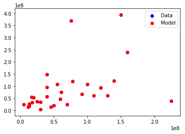
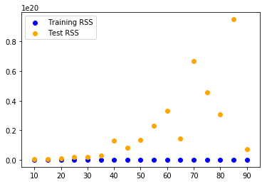

# Train Test Split <a id="toc"></a>

Thus far we've simply been fitting models to data and calculating the error between various models and the actual data. This can lead to various problems such as overfitting where we overtune our models to these specific data points and fail to disern more generalizable patterns that will apply to future cases. 

Let's look at a few examples of how we could modify some of our algorithms to overfit data:

### Introduction  

Now that you've seen some basic linear regression models it's time to discuss further how to better tune these models. As you saw, we usually begin with an error or loss function for which we'll apply an optimization algorithm such as gradient descent. We then apply this optimization algorithm to the error function we're trying to minimize and voila, we have an optimized solution! Unfortunately, things aren't quite that simple. 

### Overfitting and Underfitting
Most importantly is the issue of generalization.
This is often examined by discussing underfitting and overfitting.


Recall our main goal when performing regression: we're attempting to find relationships that can generalize to new cases. Generally, the more data that we have the better off we'll be as we can observe more patterns and relationships within that data. However, some of these patterns and relationships may not generalize well to other cases. 

## Let's intentionally overfit some data to see this in demonstration.

### 1. Import the data and define X and Y.


```python
#Import the Data here.
path = './data/' #The subdirectory where the file is stored
filename = 'movie_data_detailed.xlsx' #The filename
full_path = path + filename #Alternative shortcut

import pandas as pd

df = pd.read_excel(path+filename)
df.head()
```


<div>
<style scoped>
    .dataframe tbody tr th:only-of-type {
        vertical-align: middle;
    }

    .dataframe tbody tr th {
        vertical-align: top;
    }

    .dataframe thead th {
        text-align: right;
    }
</style>
<table border="1" class="dataframe">
  <thead>
    <tr style="text-align: right;">
      <th></th>
      <th>budget</th>
      <th>domgross</th>
      <th>title</th>
      <th>Response_Json</th>
      <th>Year</th>
      <th>imdbRating</th>
      <th>Metascore</th>
      <th>imdbVotes</th>
    </tr>
  </thead>
  <tbody>
    <tr>
      <th>0</th>
      <td>13000000</td>
      <td>25682380</td>
      <td>21 &amp;amp; Over</td>
      <td>NaN</td>
      <td>2008.0</td>
      <td>6.8</td>
      <td>48.0</td>
      <td>206513.0</td>
    </tr>
    <tr>
      <th>1</th>
      <td>45658735</td>
      <td>13414714</td>
      <td>Dredd 3D</td>
      <td>NaN</td>
      <td>2012.0</td>
      <td>NaN</td>
      <td>NaN</td>
      <td>NaN</td>
    </tr>
    <tr>
      <th>2</th>
      <td>20000000</td>
      <td>53107035</td>
      <td>12 Years a Slave</td>
      <td>NaN</td>
      <td>2013.0</td>
      <td>8.1</td>
      <td>96.0</td>
      <td>537525.0</td>
    </tr>
    <tr>
      <th>3</th>
      <td>61000000</td>
      <td>75612460</td>
      <td>2 Guns</td>
      <td>NaN</td>
      <td>2013.0</td>
      <td>6.7</td>
      <td>55.0</td>
      <td>173726.0</td>
    </tr>
    <tr>
      <th>4</th>
      <td>40000000</td>
      <td>95020213</td>
      <td>42</td>
      <td>NaN</td>
      <td>2013.0</td>
      <td>7.5</td>
      <td>62.0</td>
      <td>74170.0</td>
    </tr>
  </tbody>
</table>
</div>


```python
#Subset the Data into appropriate X and Y features. (X should be multiple features!)
X = df[['budget', 'imdbRating', 'Metascore', 'imdbVotes']]
Y = df.domgross
```

### 2. For each feature in X, create several new columns that are powers of that feature. For example, you could take the $budget$ column and produce another column $budget**2$, a third column $budget**3$, a fourth column $budget**4$ and so on. Do this until you have more columns then rows.


```python
print(len(df))
```

    30


```python
#Your code here.
#Create additional features using powers until you have more columns then rows.

orig_columns = X.columns
for feat in orig_columns:
    for i in range(2,9):
        X['{}^{}'.format(feat, i)] = X[feat].map(lambda x: x**i)
print(len(orig_columns), len(X.columns), len(X), X.columns)
X.head()
    
```

    /anaconda3/lib/python3.6/site-packages/ipykernel_launcher.py:7: SettingWithCopyWarning: 
    A value is trying to be set on a copy of a slice from a DataFrame.
    Try using .loc[row_indexer,col_indexer] = value instead
    
    See the caveats in the documentation: http://pandas.pydata.org/pandas-docs/stable/indexing.html#indexing-view-versus-copy
      import sys


    ---------------------------------------------------------------------------

    OverflowError                             Traceback (most recent call last)

    <ipython-input-8-dbd55efd0aec> in <module>()
          5 for feat in orig_columns:
          6     for i in range(2,9):
    ----> 7         X['{}^{}'.format(feat, i)] = X[feat].map(lambda x: x**i)
          8 print(len(orig_columns), len(X.columns), len(X), X.columns)
          9 X.head()


    /anaconda3/lib/python3.6/site-packages/pandas/core/series.py in map(self, arg, na_action)
       2352         else:
       2353             # arg is a function
    -> 2354             new_values = map_f(values, arg)
       2355 
       2356         return self._constructor(new_values,


    pandas/_libs/src/inference.pyx in pandas._libs.lib.map_infer()


    pandas/_libs/src/inference.pyx in pandas._libs.lib.maybe_convert_objects()


    OverflowError: Python int too large to convert to C unsigned long


### 3. Use all of your new features for X. Then train a regression model using RSS as your error function and gradient descent to tune your weights. 


```python
import sklearn.linear_model as lin
```


```python
#Your code here
def norm(col):
    minimum = col.min()
    maximum = col.max()
    return (col-maximum)/(maximum-minimum)

for col in X.columns:
    X[col] = norm(X[col])

X.head

```


<div>
<style scoped>
    .dataframe tbody tr th:only-of-type {
        vertical-align: middle;
    }

    .dataframe tbody tr th {
        vertical-align: top;
    }

    .dataframe thead th {
        text-align: right;
    }
</style>
<table border="1" class="dataframe">
  <thead>
    <tr style="text-align: right;">
      <th></th>
      <th>budget</th>
      <th>imdbRating</th>
      <th>Metascore</th>
      <th>imdbVotes</th>
      <th>budget^2</th>
      <th>budget^3</th>
      <th>budget^4</th>
      <th>budget^5</th>
      <th>budget^6</th>
      <th>budget^7</th>
      <th>...</th>
      <th>Metascore^6</th>
      <th>Metascore^7</th>
      <th>Metascore^8</th>
      <th>imdbVotes^2</th>
      <th>imdbVotes^3</th>
      <th>imdbVotes^4</th>
      <th>imdbVotes^5</th>
      <th>imdbVotes^6</th>
      <th>imdbVotes^7</th>
      <th>imdbVotes^8</th>
    </tr>
  </thead>
  <tbody>
    <tr>
      <th>0</th>
      <td>-0.965831</td>
      <td>-0.40625</td>
      <td>-0.705882</td>
      <td>-0.642623</td>
      <td>-0.997258</td>
      <td>-0.999822</td>
      <td>-0.999989</td>
      <td>-0.999999</td>
      <td>-1</td>
      <td>-1</td>
      <td>...</td>
      <td>-0.984981</td>
      <td>-0.992366</td>
      <td>-0.996146</td>
      <td>-0.853883</td>
      <td>-0.943360</td>
      <td>-0.978216</td>
      <td>-0.991630</td>
      <td>-0.996784</td>
      <td>-0.998765</td>
      <td>-0.999525</td>
    </tr>
    <tr>
      <th>1</th>
      <td>-0.817044</td>
      <td>NaN</td>
      <td>NaN</td>
      <td>NaN</td>
      <td>-0.959394</td>
      <td>-0.991658</td>
      <td>-0.998305</td>
      <td>-0.999656</td>
      <td>-0.99993</td>
      <td>-0.999986</td>
      <td>...</td>
      <td>NaN</td>
      <td>NaN</td>
      <td>NaN</td>
      <td>NaN</td>
      <td>NaN</td>
      <td>NaN</td>
      <td>NaN</td>
      <td>NaN</td>
      <td>NaN</td>
      <td>NaN</td>
    </tr>
    <tr>
      <th>2</th>
      <td>-0.933941</td>
      <td>0.00000</td>
      <td>0.000000</td>
      <td>0.000000</td>
      <td>-0.992692</td>
      <td>-0.999312</td>
      <td>-0.999938</td>
      <td>-0.999994</td>
      <td>-1</td>
      <td>-1</td>
      <td>...</td>
      <td>0.000000</td>
      <td>0.000000</td>
      <td>0.000000</td>
      <td>0.000000</td>
      <td>0.000000</td>
      <td>0.000000</td>
      <td>0.000000</td>
      <td>0.000000</td>
      <td>0.000000</td>
      <td>0.000000</td>
    </tr>
    <tr>
      <th>3</th>
      <td>-0.747153</td>
      <td>-0.43750</td>
      <td>-0.602941</td>
      <td>-0.706276</td>
      <td>-0.927053</td>
      <td>-0.980087</td>
      <td>-0.994598</td>
      <td>-0.998535</td>
      <td>-0.999603</td>
      <td>-0.999892</td>
      <td>...</td>
      <td>-0.965231</td>
      <td>-0.979916</td>
      <td>-0.988444</td>
      <td>-0.897106</td>
      <td>-0.966311</td>
      <td>-0.989092</td>
      <td>-0.996474</td>
      <td>-0.998860</td>
      <td>-0.999632</td>
      <td>-0.999881</td>
    </tr>
    <tr>
      <th>4</th>
      <td>-0.842825</td>
      <td>-0.18750</td>
      <td>-0.500000</td>
      <td>-0.899553</td>
      <td>-0.968974</td>
      <td>-0.994396</td>
      <td>-0.999001</td>
      <td>-0.999822</td>
      <td>-0.999968</td>
      <td>-0.999994</td>
      <td>...</td>
      <td>-0.928007</td>
      <td>-0.953307</td>
      <td>-0.969784</td>
      <td>-0.982671</td>
      <td>-0.997445</td>
      <td>-0.999641</td>
      <td>-0.999950</td>
      <td>-0.999993</td>
      <td>-0.999999</td>
      <td>-1.000000</td>
    </tr>
  </tbody>
</table>
<p>5 rows × 32 columns</p>
</div>


```python
X = X.fillna(value=0)
```


```python
ols = lin.LinearRegression()
```


```python
ols.fit(X, Y)
```


    LinearRegression(copy_X=True, fit_intercept=True, n_jobs=1, normalize=False)


```python
ols.coef_
```


    array([ 7.97376977e+10, -1.48055141e+14, -2.46919552e+11, -6.71838085e+11,
           -2.74524866e+12,  2.58940018e+13, -1.14474909e+14,  2.74150425e+14,
           -3.66447611e+14,  2.56817251e+14, -7.32779700e+13,  5.03419016e+14,
           -4.08272465e+14, -3.18056985e+14,  3.91793637e+14,  3.74953334e+14,
           -5.96120728e+14,  2.00338344e+14, -5.14427930e+12,  4.92020411e+13,
           -1.81490814e+14,  3.58613155e+14, -4.01339720e+14,  2.40039920e+14,
           -5.96713646e+13,  9.55240762e+12, -6.13799158e+13,  2.16523117e+14,
           -4.44553150e+14,  5.27665904e+14, -3.34456770e+14,  8.73580329e+13])


```python
ols.score(X,Y)
```


    1.0


### 4. Plot the model and the actual data on the Budget/Gross Domestic Product plane. (Remember this is just a slice of your n-dimensional space!)


```python
import matplotlib.pyplot as plt
```


```python
#Your code here
y_hat = ols.predict(X)
df['Model'] = y_hat
plt.scatter(df['budget'], df['domgross'], color='blue', label='Data')
plt.scatter(df['budget'], df['Model'], color='red', label='Model')
plt.legend()
```


    <matplotlib.legend.Legend at 0x1a175fef60>





```python
plt.scatter(df['budget'], df['Model'], color='red', label='Model')
plt.scatter(df['budget'], df['domgross'], color='blue', label='Data')
plt.legend()
```


    <matplotlib.legend.Legend at 0x1a174d2828>


```python
orig_columns
```


    Index(['budget', 'imdbRating', 'Metascore', 'imdbVotes'], dtype='object')


```python
df['residual'] = df.Model - df.domgross
df['percent_error'] = df.residual / df.domgross
df[['domgross', 'Model', 'residual', 'percent_error']].head()
```


<div>
<style scoped>
    .dataframe tbody tr th:only-of-type {
        vertical-align: middle;
    }

    .dataframe tbody tr th {
        vertical-align: top;
    }

    .dataframe thead th {
        text-align: right;
    }
</style>
<table border="1" class="dataframe">
  <thead>
    <tr style="text-align: right;">
      <th></th>
      <th>domgross</th>
      <th>Model</th>
      <th>residual</th>
      <th>percent_error</th>
    </tr>
  </thead>
  <tbody>
    <tr>
      <th>0</th>
      <td>25682380</td>
      <td>2.568238e+07</td>
      <td>0.172364</td>
      <td>6.711381e-09</td>
    </tr>
    <tr>
      <th>1</th>
      <td>13414714</td>
      <td>1.341471e+07</td>
      <td>0.434377</td>
      <td>3.238065e-08</td>
    </tr>
    <tr>
      <th>2</th>
      <td>53107035</td>
      <td>5.310704e+07</td>
      <td>0.316038</td>
      <td>5.950961e-09</td>
    </tr>
    <tr>
      <th>3</th>
      <td>75612460</td>
      <td>7.561246e+07</td>
      <td>0.142201</td>
      <td>1.880658e-09</td>
    </tr>
    <tr>
      <th>4</th>
      <td>95020213</td>
      <td>9.502021e+07</td>
      <td>0.108706</td>
      <td>1.144035e-09</td>
    </tr>
  </tbody>
</table>
</div>


```python
def rss(y, y_hat):
    return sum((y_hat - y)**2)
rss(df.domgross, df.Model)
```


    1.382182048819402


### 5. What do you notice?

#Your response here 

Note: This box (like all the questions and headers) is formatted in Markdown. See a brief cheat sheet of [markdown syntax here](https://guides.github.com/pdfs/markdown-cheatsheet-online.pdf)!

There is virtually no error!

## Train Test Split

Here lies the theoretical underpinnings for train test split. Essentially, we are trying to gauge the generalization error of our currently tuned model to future cases. (After all, that's the value of predictive models; to predict fturue states or occurences! By initially dividing our data into one set that we will optimize and train our models on, and a second hold out set that we later verify our models on but never tune them against, we can better judge how well our models will generalize to future cases outside of the scope of current observations.

### 6. Split your data (including all of those feature engineered columns) into two sets; train and test. In other words, instead of simply X and respective Y datasets, you will now have 4 subsets: X_train, y_train, X_test, and y_test.


```python
print(X.shape, Y.shape)
```

    (30, 32) (30,)


```python
sample_train =  X.sample(frac=.8)
len(sample_train)
```


    24


```python
len(X[~X.index.isin(sample_train.index)])
```


    6


```python
len(Y[~Y.index.isin(sample_train.index)])
```


    6


```python
from sklearn.model_selection import train_test_split
```


```python
X_train , X_test, y_train, y_test = train_test_split(X, Y)
```


```python
def personal_test_train_split(X, Y, train_per = .8):
    X_train = X.sample(frac=train_per)
    Y_train = Y[Y.index.isin(X_train.index)]
    X_test = X[~X.index.isin(X_train.index)]
    Y_test = Y[~Y.index.isin(X_train.index)]
    return X_train, X_test, Y_train, Y_test
```


```python
X_train , X_test, y_train, y_test = personal_test_train_split(X, Y)
```

### 7. Train your model on the train set. [As before use RSS and gradient descent, but only use the training data.]


```python
#Your code here
ols2 = lin.LinearRegression()
ols2.fit(X_train, y_train)
```


    LinearRegression(copy_X=True, fit_intercept=True, n_jobs=1, normalize=False)


### 8. Evaluate your model on the test set.


```python
rss(y_test, ols2.predict(X_test))
```


    4.7651148400726835e+17


## Bonus:   
### Iterate over training size sets from 5%-95% of the total sample size and calculate both the training error (minimized rss) and the test error (rss) for each of these splits. Plot these two curves (train error vs. training size and test error vs. training size) on a graph. 


```python
train_size = []
train_rss = []
test_rss = []

for i in range(10,95,5):
    train_scores = []
    test_scores = []
    for n in range(10**2):
        #Split
        X_train , X_test, y_train, y_test = personal_test_train_split(X, Y, train_per=i/100.0)
        #Fit
        ols2 = lin.LinearRegression()
        ols2.fit(X_train, y_train)
        #RSS
        train_err = rss(y_train, ols2.predict(X_train))
        test_err = rss(y_test, ols2.predict(X_test))
        #Append to Temp Storage
        train_scores.append(train_err)
        test_scores.append(test_err)
    train_rss.append(np.median(train_scores))
    test_rss.append(np.median(test_scores))
    train_size.append(i)
plt.scatter(train_size, train_rss, color = 'blue', label='Training RSS')
plt.scatter(train_size, test_rss, color = 'orange', label='Test RSS')
plt.legend()
```


    <matplotlib.legend.Legend at 0x1a180b7e48>




